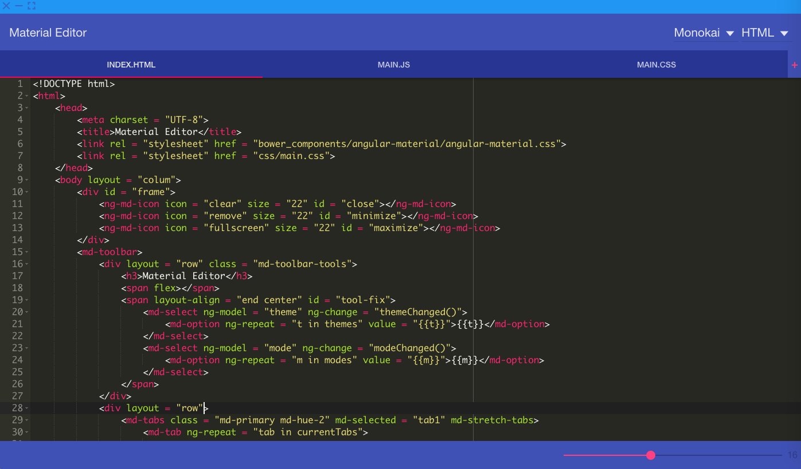

# Material Editor

Material Editor is an open-source text editor for Mac build using [nw.js](http://nwjs.io),  [Ace](http://ace.c9.io) and [Angular Material](https://material.angularjs.org/#/). 
Feel free to contribue and improve the editor, right now the functionality is pretty basic (the project is quite young).

##TODO
- Add functionality to tabs with routing
- Add open/save support (by figuring out how to interact with ui-ace outside of the scope of the controller)
- Fix theme changing issue
- Add copy/paste support (for some reason quite difficult when using node webkit and a third party editing area).

